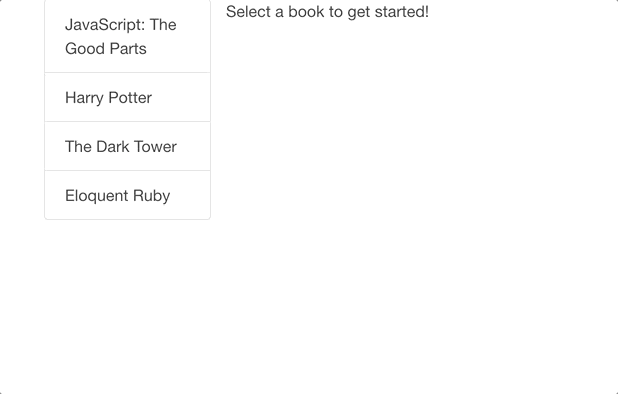
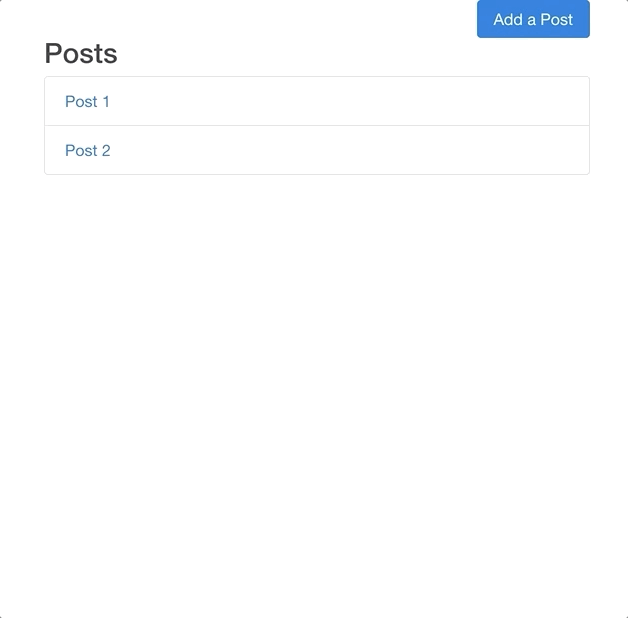

# React/Redux Sandbox

#### Author: Jarid Warren [ <jaridwarren@gmail.com> ]

A collection of mini applications to practice with the React/Redux front-end stack.

### 1. Book List

- Basic single page rendering
- State management with Redux



### 2. Video Player

- Closed container (search bar text)
- YouTube API
- State management with Redux


### 3. Blog SPA

- React router to create a SPA
- API interface with axios
- Lodash for added computation
- State management with Redux



### 4. Weather App

- Sparklines React component for graphing data
- API interface with axios
- Lodash for added computation
- State management with Redux


## Motivation

These mini apps serve to practice common React/Redux implementations, additional React/Redux packages, and generally learn more about the toolset.

## Technology

-  React.js /   Redux
-  npm /   Webpack /  Babel

## Code Sample

Below is the ReactDOM render method of the root component in `blog-spa`. Here, `react-router` is used for navigation in the SPA.

```javascript
// blog-spa/src/index.js:15
ReactDOM.render(
  <Provider store={createStoreWithMiddleware(reducers)}>
    <BrowserRouter>
      <div>
        <Switch>
          {/* put most specific routes to the top of the list with Switch */}
          <Route path="/posts/new" component={PostsNew} />
          <Route path="/posts/:id" component={PostsShow} />
          <Route path="/" component={PostsIndex} />
        </Switch>
      </div>
    </BrowserRouter>
  </Provider>,
  document.querySelector('.container')
```

## Setup
Download or clone repo, then run the following commands in terminal inside each app folder (ie. `./blog-spa`, `.weather`, etc.):

**Initialize NPM:**

`> npm init` 

**Install Webpack:**

`> npm install`

**Build and launch dev-server:**

`> npm run start`

## @TODO

* Add more styles to existing projects

